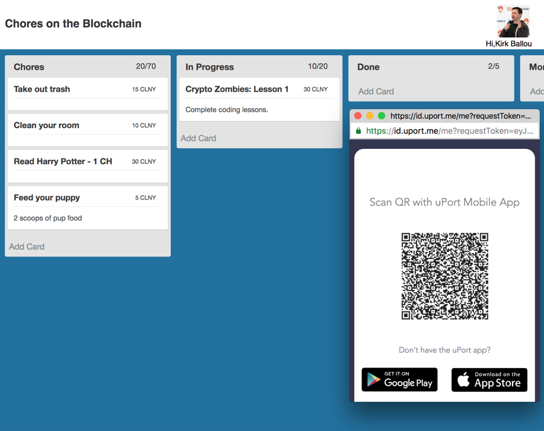

# Colony Trello dApp
A team task management dApp using Colony.io + uPort on a Trello sytle board.

We combined the Colony.io demo with the React-Trello boilerplate demo and added uPort authentication.

 

Demo Video
[dApp Demo Video](http://www.youtube.com/watch?v=vg4r8eRJZmU)
